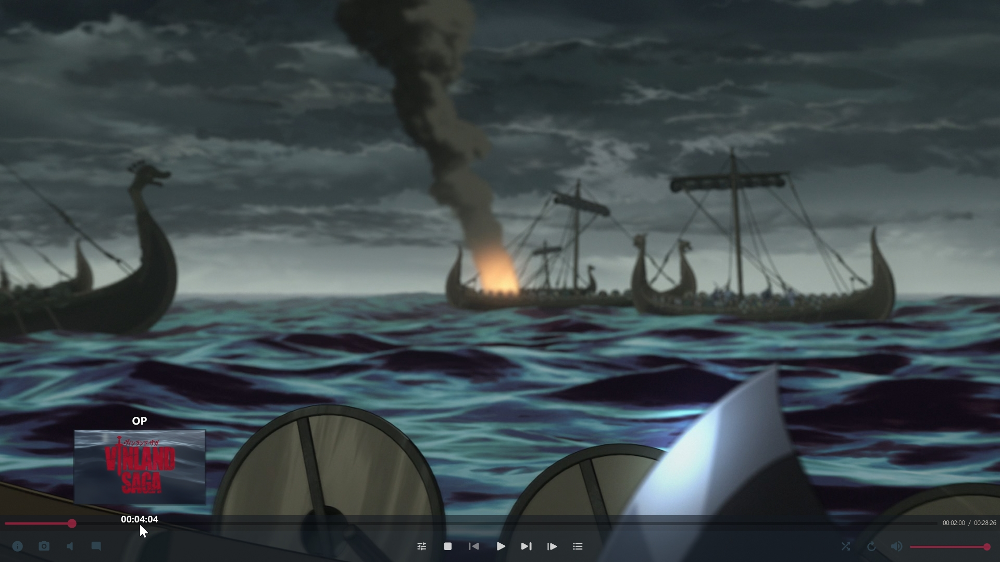

# Splash OSC
Modern interface for mpv


Add ```.\scripts``` and ```.\fonts``` to your mpv config folder to use the skin

## Screenshots
### Main


### With topbar


(Run ```mpv --no-border``` or add ```border=no``` line to your ```mpv.conf``` file to enable the topbar)
